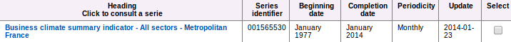
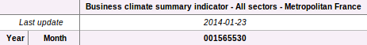

# INSEE BDM Scraper
Python utility based on [Scrapy](http://scrapy.org/) & [Pandas](http://pandas.pydata.org/) for BDM data download automation (as there is no API for now). This utility is meant to download monthly series as they are the most common in the BDM database. If you want to extract quarterly or weekly data, you may have to hack the spider.

Please read the [INSEE copyright notice](http://www.insee.fr/en/publications-et-services/default.asp?page=copyright.htm) before any scraping.

Tested on ubuntu 13.10

## Installation

Just clone the repository wherever you want (e.g. `~/scraping/`)

	git clone git@github.com:MaryanMorel/inseeBdmScraper.git

or

	git clone https://github.com/MaryanMorel/inseeBdmScraper.git

Be sure to have the all the dependencies installed (see below)

## Usage
Insee BDM series are identified by an `idbank`. You can find it when you search for data:

When you look at data:

Or in the url of the series view page:

[http://www.bdm.insee.fr/bdm2/affichageSeries.action?idbank=**001565530**&codeGroupe=1007](http://www.bdm.insee.fr/bdm2/affichageSeries.action?idbank=001565530&codeGroupe=1007)

In order to use the scraper, just run the following commands in your terminal: 
	
	cd ~/path/to/inseeBdmScraper			
	scrapy crawl insee -a idBank=001565530

The first line set your working directory to inseeBdmScraper root directory, the second line execute the scraper. By default, Scraped data will be available in your home directory (.csv, utf8 encoding). You can change this behaviour by editing the `OUTPUT_PATH` variable in settings.py.

Crawl responsibly by identifying yourself (and your website) on the user-agent, edit the settings.py file :

	USER_AGENT = 'inseeBdmScraper (+http://www.yourdomain.com)'

## Dependencies
	Python 2.7.x
	Scrapy 0.22.2
	Pandas 0.13.0

 This work is licensed under a <a rel="license" href="http://creativecommons.org/licenses/by-sa/4.0/deed.en_US">Creative Commons Attribution-ShareAlike 4.0 International License</a>.